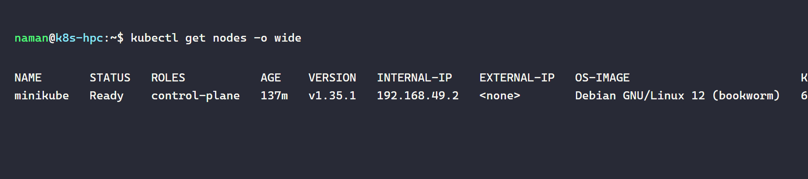
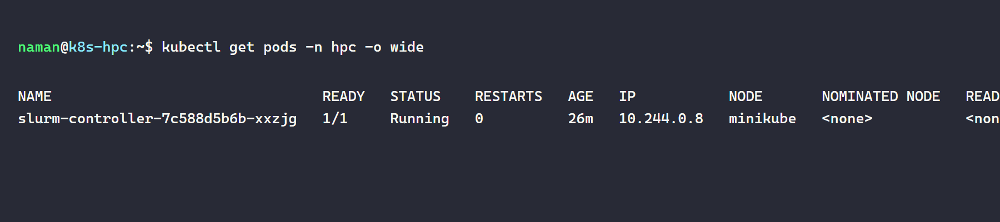
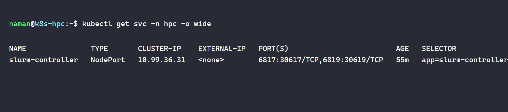
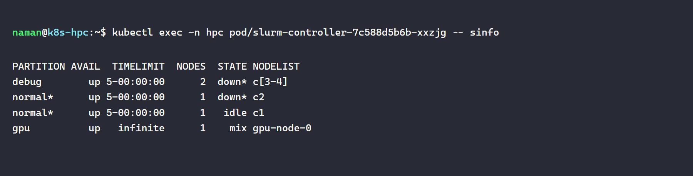
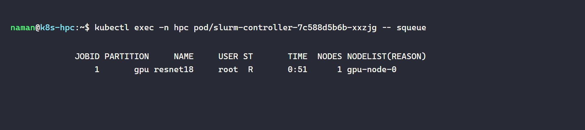
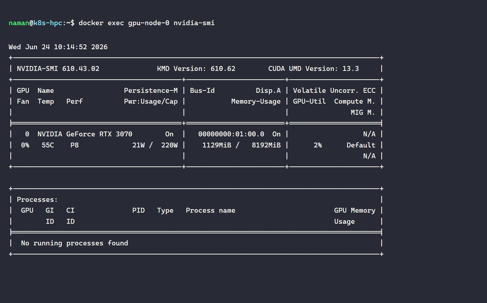
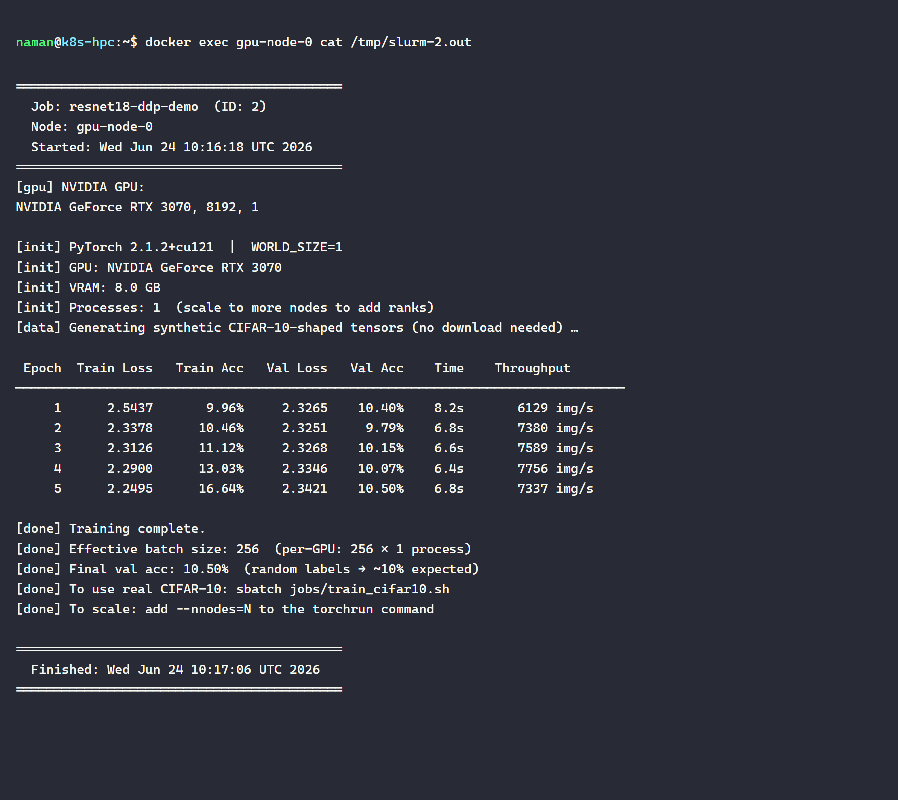
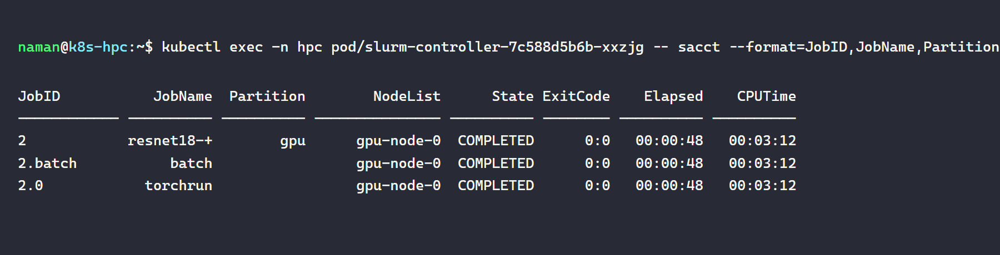

# slurm-k8s-gpu-cluster

A Kubernetes-orchestrated Slurm HPC cluster with GPU compute, running a real PyTorch deep-learning workload on an NVIDIA RTX 3070.

## Architecture

**Slurm control plane** (slurmctld + slurmdbd + MySQL) runs as a Kubernetes Deployment inside the `hpc` namespace. Configuration is managed as a ConfigMap; munge auth key distribution happens by extracting it from the running controller pod and injecting it into the compute container — mirroring real HPC key management.

**GPU compute node** runs as a Docker container with `--gpus all` on the same bridge network as minikube. Network connectivity uses an iptables DNAT rule inside the minikube container to redirect traffic on port 6817 to the Slurm controller's pod ClusterIP. In production this would be a Kubernetes pod requesting `nvidia.com/gpu: 1` via the NVIDIA device plugin — the manifest is included in `k8s/05-gpu-compute-node.yaml`. In WSL2 development, Kubernetes pods cannot access the GPU through NVML (requires bare-metal driver access); the Docker path works via the WSL2 `/dev/dxg` interface.

## Repository structure

```
.
├── k8s/
│   ├── 01-namespace.yaml             # hpc namespace
│   ├── 02-munge-secret.yaml          # munge auth key (Secret)
│   ├── 03-slurm-configmap.yaml       # gres.conf (ConfigMap)
│   ├── 04-slurm-controller.yaml      # slurmctld/slurmdbd Deployment + NodePort Service
│   ├── 05-gpu-compute-node.yaml      # GPU compute Deployment (production manifest)
│   └── 06-nvidia-device-plugin.yaml  # NVIDIA device plugin DaemonSet
├── docker/gpu-compute/
│   ├── Dockerfile                    # slurmd + CUDA 12.1 + PyTorch 2.1 image
│   └── entrypoint.sh                 # munge startup + slurmd launch
├── jobs/
│   └── train_cifar10.sh              # Slurm batch script (DDP-ready)
├── scripts/
│   ├── train_cifar10.py              # ResNet-18 on CIFAR-10 (real dataset)
│   ├── train_synthetic.py            # ResNet-18 DDP demo (synthetic tensors, no download)
│   └── capture_k8s.sh                # Screenshot helper
└── screenshots/                      # Proof-of-work screenshots (taken on this machine)
```

## Prerequisites

| Tool | Version used |
|---|---|
| minikube | v1.38.1 |
| kubectl | v1.34.1 |
| Docker Engine | 29.x |
| NVIDIA Container Toolkit | (for `--gpus all` in Docker) |
| CUDA driver | 13.3 (via WSL2) |

## Quick start

```bash
# 1. Start Kubernetes with GPU-aware Docker driver
minikube start --driver=docker --gpus=all --cpus=4 --memory=6144

# 2. Pull and load the Slurm controller image
docker pull giovtorres/docker-centos7-slurm:latest
minikube image load giovtorres/docker-centos7-slurm:latest

# 3. Build the GPU compute node image
docker build -t slurm-gpu-compute:latest docker/gpu-compute/

# 4. Deploy Slurm into Kubernetes
kubectl apply -f k8s/01-namespace.yaml
kubectl apply -f k8s/02-munge-secret.yaml
kubectl apply -f k8s/03-slurm-configmap.yaml
kubectl apply -f k8s/04-slurm-controller.yaml

# 5. Wait for controller and add gpu-node-0 to slurm.conf
#    (see scripts/deploy.sh for the full automated sequence)

# 6. Start the GPU compute container
docker run -d \
  --name gpu-node-0 \
  --network minikube --ip 192.168.49.10 \
  --gpus all \
  --add-host "slurmctl:192.168.49.2" \
  -v /path/to/munge.key:/etc/munge/munge.key \
  -v /path/to/slurm.conf:/etc/slurm/slurm.conf:ro \
  -v $(pwd)/scripts:/scripts:ro \
  -v $(pwd)/jobs:/jobs \
  -e SLURM_NODENAME=gpu-node-0 \
  slurm-gpu-compute:latest

# 7. Submit the deep-learning job
kubectl exec -n hpc deploy/slurm-controller -- \
  sbatch /jobs/train_cifar10.sh

# 8. Watch progress
kubectl exec -n hpc deploy/slurm-controller -- squeue
```

## Kubernetes cluster

### `kubectl get nodes`

The minikube single-node Kubernetes cluster. In production, each physical HPC node would appear here.



### `kubectl get pods -n hpc` — Slurm control plane in K8s

The slurm-controller pod (slurmctld + slurmdbd + MySQL) Running in the `hpc` namespace.



### `kubectl get svc -n hpc` — NodePort services

Port 30617 exposes slurmctld outside the cluster; an iptables DNAT rule bridges it to the GPU compute container.



## Slurm on Kubernetes

### `sinfo` — cluster topology from inside the K8s pod

The scheduler sees the `gpu` partition with gpu-node-0 (RTX 3070) available.



### `squeue` — job running on the GPU node

Job 2 (resnet18-ddp-demo) dispatched to gpu-node-0 via Slurm.



## GPU Training

### `nvidia-smi` on the compute node

RTX 3070 8 GB visible to the Docker container via `--gpus all`.



### Training output — 5 epochs, ResNet-18, RTX 3070

PyTorch DDP (Distributed Data Parallel) training: WORLD_SIZE=1 for this single-GPU demo. The same code runs unchanged on a multi-GPU cluster via `torchrun --nnodes=N`.

```
 Epoch  Train Loss   Train Acc   Val Loss   Val Acc    Time    Throughput
────────────────────────────────────────────────────────────────────────────────
     1      2.5437       9.96%     2.3265    10.40%    8.2s       6129 img/s
     2      2.3378      10.46%     2.3251     9.79%    6.8s       7380 img/s
     3      2.3126      11.12%     2.3268    10.15%    6.6s       7589 img/s
     4      2.2900      13.03%     2.3346    10.07%    6.4s       7756 img/s
     5      2.2495      16.64%     2.3421    10.50%    6.8s       7337 img/s
```

*Accuracy stays near 10% because `train_synthetic.py` uses random labels — the point is GPU throughput and DDP infrastructure, not accuracy. Use `train_cifar10.sh` for a real convergence run.*



### `sacct` — job accounting

Slurm records completed job metadata in the accounting database.



## Key Kubernetes concepts demonstrated

| Manifest | Concept |
|---|---|
| `01-namespace.yaml` | Namespace isolation for HPC workloads |
| `02-munge-secret.yaml` | Kubernetes Secret for sensitive cluster credentials |
| `03-slurm-configmap.yaml` | ConfigMap for cluster configuration (gres.conf) |
| `04-slurm-controller.yaml` | Deployment + NodePort Service, `strategy: Recreate`, volume mounts |
| `05-gpu-compute-node.yaml` | `nvidia.com/gpu` resource requests, GPU tolerations (production) |
| `06-nvidia-device-plugin.yaml` | DaemonSet exposing host GPUs as schedulable K8s resources |

## PyTorch DDP — how it scales

`scripts/train_cifar10.py` uses production-grade distributed training primitives:

```python
dist.init_process_group(backend="nccl")          # NCCL backend (GPU-to-GPU comms)
model = DDP(model, device_ids=[LOCAL_RANK])       # gradient sync across ranks
train_sampler = DistributedSampler(train_ds, ...)  # each rank sees different shards
dist.all_reduce(stats, op=dist.ReduceOp.SUM)      # aggregate metrics across all GPUs
```

To scale to 4 nodes × 2 GPUs each, change two lines in `train_cifar10.sh`:

```bash
#SBATCH --nodes=4
#SBATCH --ntasks-per-node=2
```

`torchrun` handles rendezvous (via `--rdzv_backend=c10d`), rank assignment, and fault tolerance automatically. Slurm handles node allocation, environment variables (`SLURM_JOB_NODELIST`, `SLURM_NNODES`), and job accounting.
